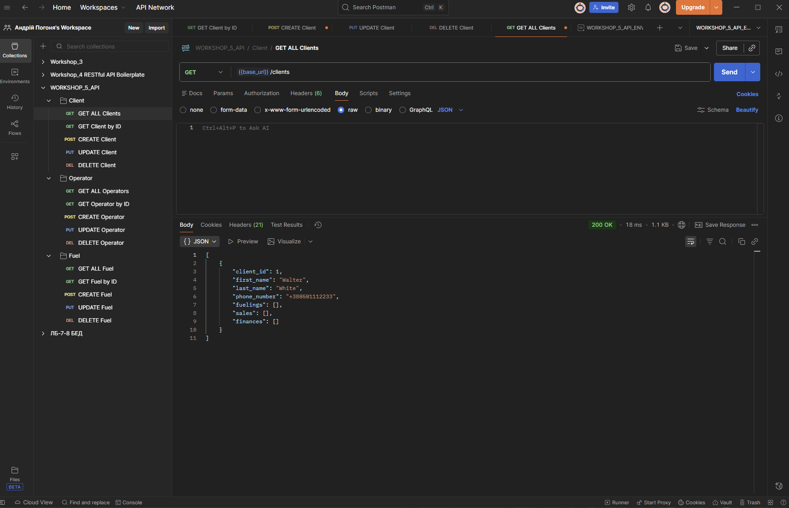
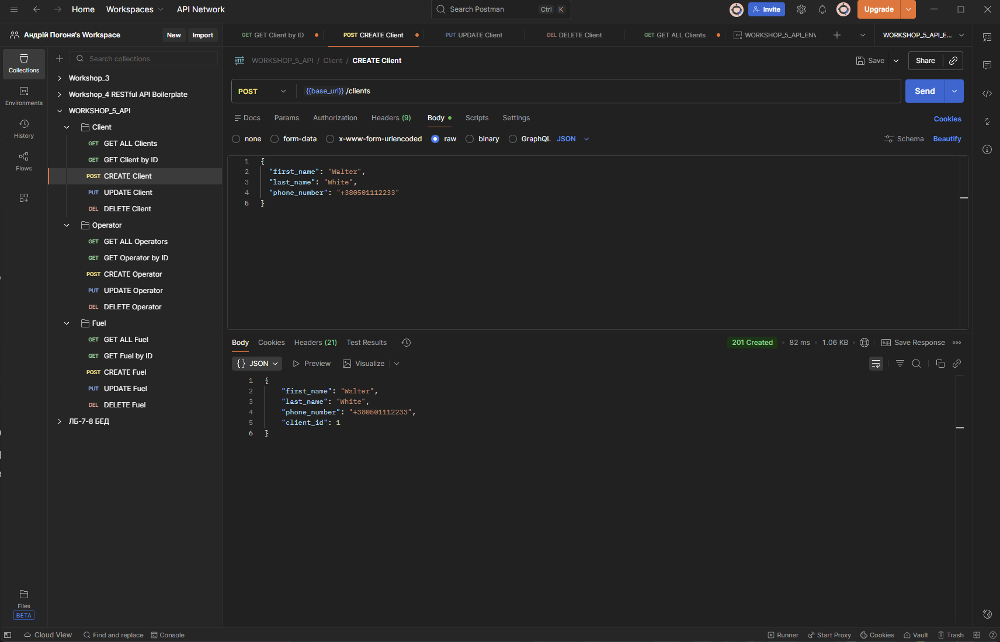
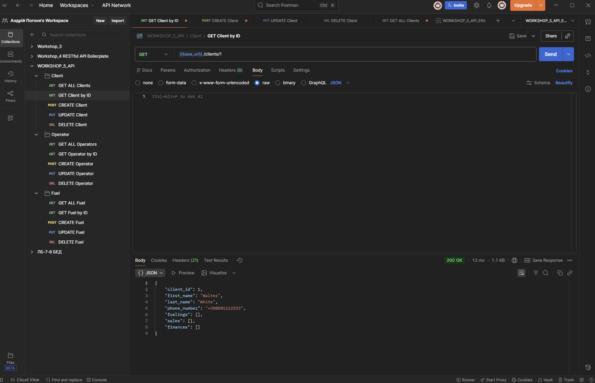
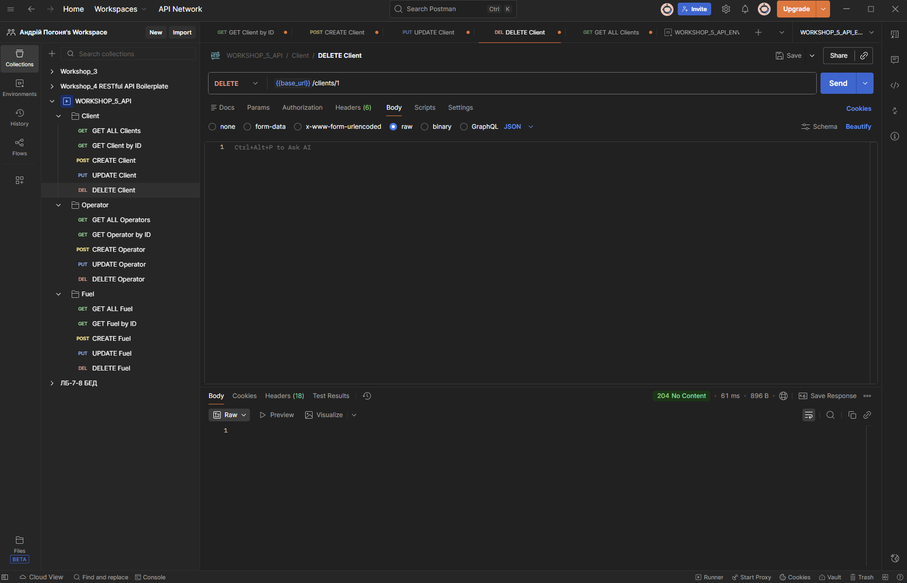
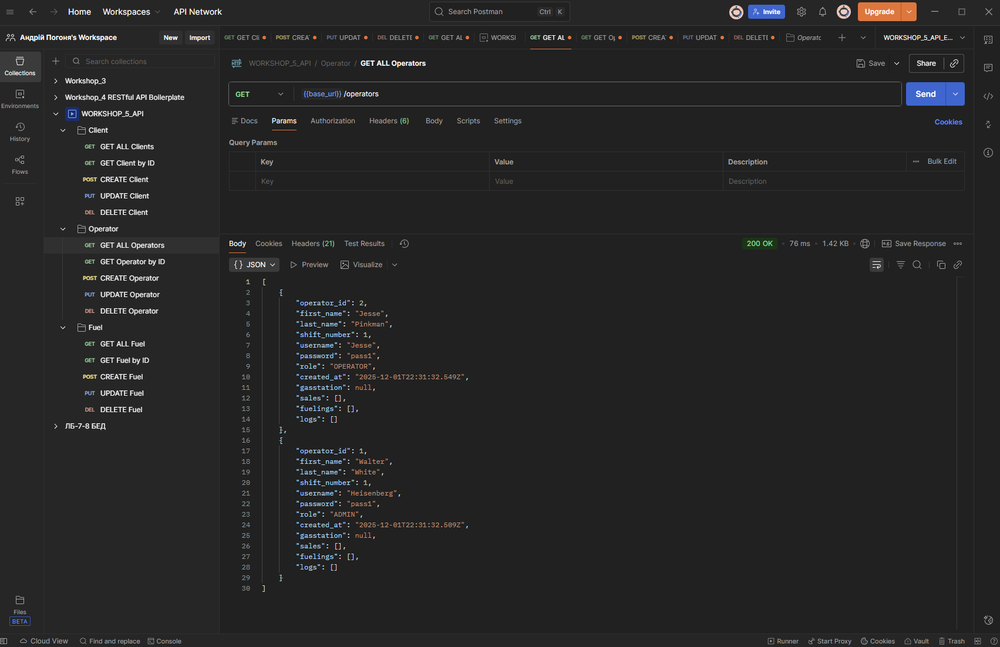
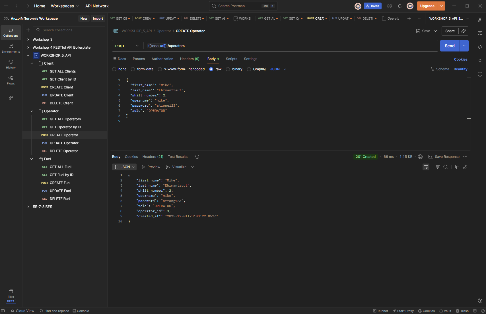
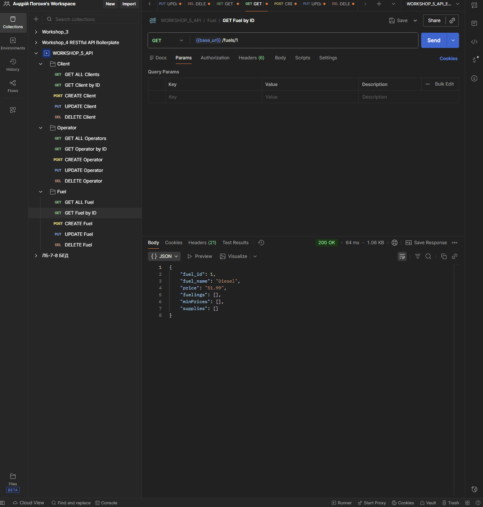
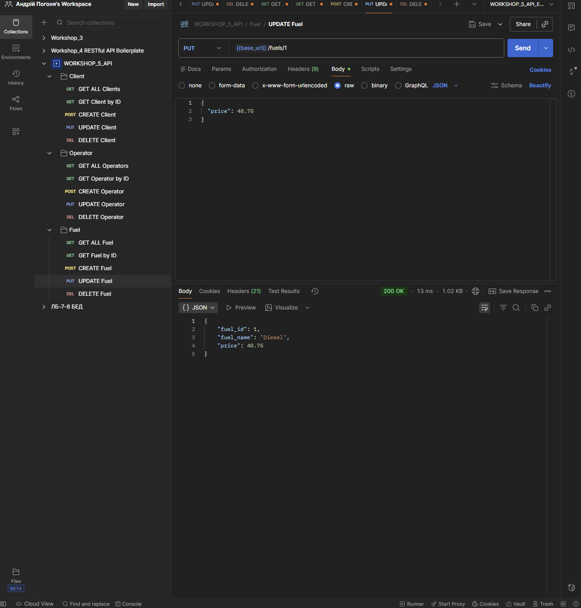

# 🛢️ REST API для мережі АЗС — Workshop 5

## Автор: Погоня Андрій ІПЗ‑3.03

## 📌 Опис проєкту

Проєкт реалізує серверну частину АЗС на базі **Express + TypeORM + PostgreSQL**.
Передбачає CRUD API для основних сутностей, контейнеризацію через **Docker**, використання **міграцій** та тестування через **Postman**.

---

📁 Структура файлів

```
src/
 ├── controllers/
 │   ├── Client/
 │   ├── Operator/
 │   ├── Fuel/
 ├── orm/
 │   ├── entities/
 │   │   ├── Client/
 │   │   ├── Operator/
 │   │   ├── Fuel/
 │   ├── migrations/
 │   ├── config/
 ├── routes/
 │   ├── client.routes.ts
 │   ├── fuel.routes.ts
 │   ├── operator.routes.ts
 │   ├── index.ts
 ├── index.ts
```

🐳 Docker запуск

🔥 Development

```bash
npm run docker:dev
```

Сервер і база піднімаються автоматично.

🛢️ Міграції
🔧 Створення

```bash
npm run migration:generate -- -n NAME
```

▶️ Виконання

```bash
npm run migration:run
```

🧨 Відкат

```bash
npm run migration:revert
```

## 🧱 Реалізовані сутності та зв’язки

### 👤 Client

📌 Зберігає інформацію про клієнтів АЗС.

**Поля:**

- `client_id`: Primary Key
- `first_name`: string
- `last_name`: string
- `phone_number`: string | null

**Зв’язки:**

- 1 : N → Fueling
- 1 : N → ShopSales
- 1 : N → Finance

---

### 👷 Operator

📌 Працівник АЗС. Має роль.

**Поля:**

- `operator_id`
- `first_name`
- `last_name`
- `username` — Унікальний
- `password`
- `role`: enum(ADMIN | OPERATOR)
- `shift_number`
- `created_at`
- `gasstation`: FK

**Зв’язки:**

- 1 : N → Fueling
- 1 : N → ShopSales
- 1 : N → OperatorLog

---

### ⛽ Fuel

📌 Тип пального.

**Поля:**

- `fuel_id`
- `fuel_name`
- `price`

**Зв’язки:**

- 1 : N → Fueling
- 1 : N → FuelMinPrice
- 1 : N → Supply

---

## 🌐 API ендпоінти

### 📍 Client routes

| Метод  | Ендпоінт       | Опис           |
| ------ | -------------- | -------------- |
| GET    | `/clients`     | Отримати всіх  |
| GET    | `/clients/:id` | Отримати по ID |
| POST   | `/clients`     | Створити       |
| PUT    | `/clients/:id` | Оновити        |
| DELETE | `/clients/:id` | Видалити       |

---

### 📍 Operator routes

| Метод  | Ендпоінт         | Опис           |
| ------ | ---------------- | -------------- |
| GET    | `/operators`     | Отримати всіх  |
| GET    | `/operators/:id` | Отримати по ID |
| POST   | `/operators`     | Створити       |
| PUT    | `/operators/:id` | Оновити        |
| DELETE | `/operators/:id` | Видалити       |

---

### 📍 Fuel routes

| Метод  | Ендпоінт     | Опис           |
| ------ | ------------ | -------------- |
| GET    | `/fuels`     | Отримати всі   |
| GET    | `/fuels/:id` | Отримати по ID |
| POST   | `/fuels`     | Створити       |
| PUT    | `/fuels/:id` | Оновити        |
| DELETE | `/fuels/:id` | Видалити       |

---

## 🧪 Приклади запитів (Postman)

### 🔹 Створення клієнта

```http
POST /clients
Content-Type: application/json

{
  "first_name": "Walter",
  "last_name": "White",
  "phone_number": "+380501112233"
}
```

🔹 Створення пального

```http
POST /fuels
{
  "fuel_name": "Diesel",
  "price": 51.99
}
```

🔹 Оновлення пального

```http
PUT /fuels/1
{
  "price": 48.75
}
```

## 📷 Скріншоти Postman:

### GET /clients — список

<p align="center">
  
</p>

### POST /clients — створення

<p align="center">
  
</p>

### GET /clients/:id— спиcок по ID

<p align="center">
  
</p>

### PUT /clients/:id — оновлення

<p align="center">
  
</p>

### DELETE /clients/:id — видалення

<p align="center">
  
</p>

### GET /operators — список

<p align="center"> 
  
</p>

### POST /operators — створення

<p align="center"> 
  
</p>

### GET /operators/:id — отримання по ID

<p align="center"> 
  
</p>

### PUT /operators/:id — оновлення

<p align="center"> 
  
</p>

### DELETE /operators/:id — видалення

<p align="center"> 
  
</p>

### GET /fuels — список

<p align="center"> 
  
</p>

### POST /fuels — створення

<p align="center"> 
  
</p>

### GET /fuels/:id — отримання по ID

<p align="center"> 
  
</p>

### PUT /fuels/:id — оновлення

<p align="center"> 
  
</p>

### DELETE /fuels/:id — видалення

<p align="center"> 
  
</p>

# 📌 Висновок

У рамках виконання лабораторної роботи було розроблено повноцінний серверний застосунок для інформаційної системи мережі АЗС. Проєкт побудовано з використанням сучасних технологій — Node.js, Express, TypeScript та TypeORM, що дозволило створити масштабовану архітектуру з чітким розподілом бізнес-логіки, роутів та доступу до бази даних.
База даних реалізована на PostgreSQL, що забезпечує високий рівень надійності, транзакційності та підтримки складних зв’язків між сутностями. Усі таблиці побудовані з використанням GENERATED ALWAYS AS IDENTITY, що відповідає сучасним практикам замість застарілого типу SERIAL.
Сутності Client, Operator та Fuel реалізовані відповідно до вимог предметної області. Для кожної сутності створено моделі, контролери, роутери та сервісні методи, що забезпечують чисту та підтримувану структуру коду.
Для кожної сутності реалізовано CRUD-ендпоінти, що включають операції створення, отримання, оновлення та видалення. Усі маршрути протестовані через Postman, а результати запитів задокументовані у вигляді скріншотів, що відображають коректність роботи API.
В результаті виконання роботи створено готову до розширення частину бекенд-системи, яка може бути масштабована новими сутностями, модулями, сервісами та функціональністю. Система може бути використана як основа для майбутньої курсової роботи або реального застосунку мережі АЗС.
